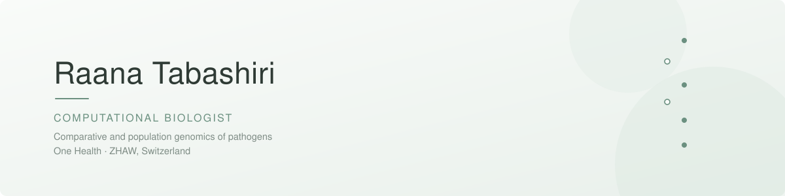

  

  
  
  
  
  
  

 

I work at the intersection of comparative genomics, population genetics and
infectious disease, turning large sequencing datasets into results that hold up
to scrutiny.

Currently a visiting researcher at the **ZHAW School of Life Sciences and
Facility Management** in Wädenswil, Switzerland.

> I care as much about knowing when a method fails as about running it.

 

### Current work

|  | |
|---|---|
| **Viral pangenomics** | Genus-wide analysis of 290 *Capripoxvirus* genomes — orthogroup inference, ML phylogenetics, recombination detection, selection analysis |
| **Bacterial pangenomics** | Pangenome and short tandem repeat landscape of *Mycobacterium avium* subsp. *paratuberculosis* |
| **One Health** | Integrated host–pathogen analysis of Johne's disease in cattle and Crohn's disease in humans |

 

### Selected publications

**Genome-wide post-transcriptional regulation of bovine mammary gland response to *Streptococcus uberis***
Tabashiri R. *et al.* · *Journal of Applied Genetics* (2022) · [10.1007/s13353-022-00722-y](https://doi.org/10.1007/s13353-022-00722-y)

**Integrated co-expression analysis of regulatory elements (miRNA, lncRNA, TFs) in bovine monocytes induced by *Str. uberis***
Sharifi S. *et al.* · *Scientific Reports* (2023) · [10.1038/s41598-023-42067-4](https://doi.org/10.1038/s41598-023-42067-4)

 

### Elsewhere

<a href="https://orcid.org/0009-0003-7975-6686">ORCID</a> ·
<a href="https://linkedin.com/in/rana-tabashiri">LinkedIn</a> ·
<a href="mailto:ranatabashiri@gmail.com">Email</a>
